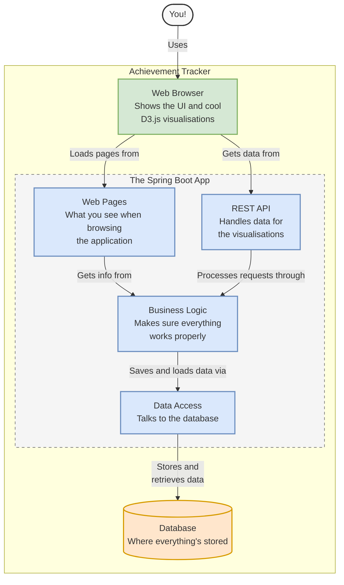

# Achievement Tracker

Hey, there! This is my Achievement Tracker app - a side project I built to track personal and professional accomplishments
while developing my Spring Boot skills.

## What It Does

This app helps you keep tabs on things you want to accomplish:

- **Track Achievements**: View your achievements and their current status
- **Monitor Progress**: See which items are TODO, IN_PROGRESS, or COMPLETED
- **Visualise Data**: Check out some cool visualisations to see your progress:
    - Achievements summary table
    - Timeline view of your achievements
    - Status distribution (how many items in each category)
    - Tag cloud showing what kinds of achievements you're tracking
    - Time to completion stats
- **Find Stuff Easily**: Filter achievements by title or status

## How It's Built

Here's a look at how the pieces fit together:

## How It Works

The app is pretty straightforward:

1. **Browser**: This is what you use to view and interact with the app. It shows the UI and renders those neat D3.js visualisations.

2. **Spring Boot Application**: The behind-the-scenes stuff that makes everything work:
    - **Web Pages**: These are built with Thymeleaf templates
    - **REST API**: Handles data operations for the visualisations
    - **Business Logic**: Makes sure everything works properly
    - **Data Access**: Manages communication with the database

3. **Database**: Where all the achievement data lives (H2 for development, PostgreSQL for production)

## Getting Started

To use the application in its current state:

1. Set up the database initialisation as described in the [DATABASE_INITIALISATION.md](/docs/DATABASE_INITIALISATION.md) document
2. Create your achievement records in the database (there's no UI for adding achievements yet)
3. Start the application locally
4. Access the achievements page to view the achievements you've added to the database (`localhost:8080/achievements`)
5. Explore the visualisations that represent your achievement data
6. Use the search functionality and status filter to navigate your achievements

## Tech I Used

Built this project to sharpen my skills with:
- Spring Boot 3.4.x
- Thymeleaf for server-side rendering
- D3.js for data visualisation
- JPA/Hibernate for database operations
- Bootstrap for styling
- JUnit and Mockito for testing

## Future Plans

This is a work in progress! Some features I might add:
- User authentication
- Ability to add and edit achievements through the UI
- More visualization options
- Email reminders for overdue achievements
- Mobile-friendly improvements
- Improve documentation, e.g., how to deploy the app

Feel free to fork the repo if you want to try it out or contribute!